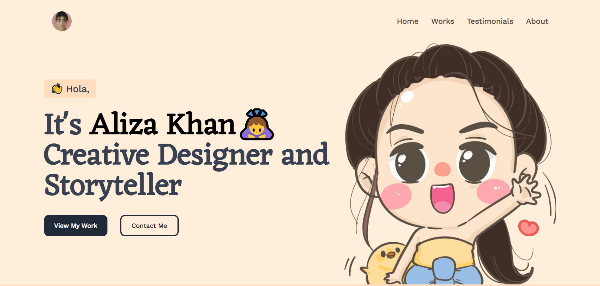

<h1 align="center">Welcome to Designer-portfolio 👋</h1>

<h4 align="center">Spacial Credit goes to : <a target="_blank" href="https://www.figma.com/@salmanwap">@salmanwap</h4>

<hr/>

## A Simple Portfolio Template built with VueJS (Vite) + TailwindCss

<p align="center">
  <kbd>
    </img>
  </kbd>
</p>

<h3>To view a live / Demo : <a target="_blank" href="https://desinger-portfolio.netlify.app/">click here</h3>

## Sections

✔️ Home Page Banner
✔️ Works
✔️ Testimonial
✔️ Contact

## Getting Started

These instructions will get you a copy of the project up and running on your local machine for development and testing purposes.

## How To Use

From your command line, clone and run Designer-Portfolio:

```bash
# Clone this repository
$ git clone

# Go into the repository
$ cd Designer-portfolio

# Install dependencies
$ npm install

#Start's development server
$ npm run dev
```

## License

No Restrictions, you can edit, add & sell.

## Show your support

Give a ⭐️ if this project helped you!

Credit goes to : [Adam Wathan](https://codepen.io/adamwathan/pen/QWLEJGr) for portfolio section
